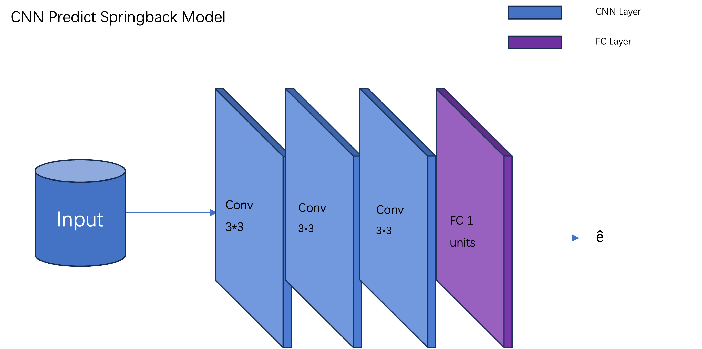

# SPIF(Single Point Increment Forming) Prediction Project

This is a project that uses artificial intelligence technology to predict rebound error for SPIF.
At present, the prediction of springback error has been realized through GRU and CNN.

The entire project is based on pytorch and scikit-learn libraries.

## Install Package

1. Clone project：

```bash
git clone git@github.com:DarrenChen0923/SPIF_DU.git
```

2. Install scikit-learn:
```bash
pip install scikit-learn
```

3. Install Pytorch:
```bash
pip install torch torchvision torchaudio
```
There are also some libraries commonly used in artificial intelligence that need to be installed (numpy, matplotlib, etc.). You can install them according to the prompts.

## Dataset
The project has 4 sets of original data, namely D4_1_completo.txt, D4_2_completo.txt, D4_3_completo.txt and fin_reg.txt in MainFolder. Fin_reg is called Fin and the remaining three are called Fout.

Process raw data according to different project requirements

1. Heatmap

Cropping image data in a folder called Croppings.
This folder has four subfolders: f1_out,f2_out,f3_out, and fin. Coresponding to four raw data.

The path to the data used to generate the Fout heat map
```bash
.../MainFolder/{d}mm_file/outfile{fnum}/gridized{d}mm_error_cloud{fnum}.txt

d: Grid size (5,10,15,20)
fum: Fout number (1,2,3)
```

The path to the data used to generate the Fin heat map
```bash
.../MainFolder/fin_reg.txt
```


All data sets are split into training sets and test sets according to the ratio of 8:2. Use fixed training sets and data sets for training, and you can use these data sets directly if you need to reproduce.

The training dataset path:

```
.../SPIF_DU/Croppings/version_2/train_dataset

```


The test dataset:

```
.../SPIF_DU/Croppings/version_2/test_dataset

```


Combine different grid size train folder data and test folder data into train_dataset and test_dataset.


The train_dataset download link is:  
https://drive.google.com/drive/folders/1B7ld0EswgVw5IyhCO2LgzUGP0BrhRYfB?usp=drive_link  


The test_dataset download link is:  
https://drive.google.com/drive/folders/1bOMF969vcIk4wiKZus4h_gE8rrmsDepw?usp=drive_link


## Model
The CNN architecture consisted of (i) three 3*3 convolutional layers and (ii) a dense (fully connected) layer with 1 node for predicting springback error. The architecture is illustrated in Figure \ref{fig:cnnArchitecture}. A learning rate of $\alpha = 0.001$, a batch size $= 64$, and an epoch size $e = 1000$ were used. 



## Run Code

1. Generate Heatmap

```bash
Generate Fin file heatmap
file_path = f'/Users/darren/资料/SPIF_DU/MainFolder/fin_reg.txt'

Generate Fout file heatmap
# file_path = f'/Users/darren/资料/SPIF_DU/MainFolder/{d}mm_file/outfile{fnum}/gridized{d}mm_error_cloud{fnum}.txt'
d: Grid size (5,10,15,20)
fum: Fout number (1,2,3)

python3 hotmap.py
```
Change to right directory according to your machine.

2. Run CNN model

```bash
python3 heatmap_cnn.py

```

3. Draw figure(line chart)

```bash
python3 draw_fig.py
```

## Evaluation

File `evalution_heatmap.py` is used for the evaluation model.

```
Change the model_path's parameters for different grid sizes.
model_path = f'/Users/darren/资料/SPIF_DU/Croppings/version_{version}/models/model_version{version}_grid{grids[0]}_epo{num_epochs}_batch{batch}_lr{learning_rate}.pth'

The prefix (/Users/darren/资料/) can change your path.

grids[0] can be {5,10,15,20}

```


## Result
The training result from the train dataset
| Grid Size | MAE | MSE | RMSE | R2 |
| :---         |     :---:      |          ---: |     :---:      |          ---: |
| 5mm   | 0.49080    | 0.44639   | 0.66812    | 0.70745      |
| 10mm  | 0.20859    | 0.08115   | 0.28487    | 0.92472      |
| 15mm  | 0.13565    | 0.03673   | 0.19165    | 0.94455      |
| 20mm  | 0.14679    | 0.04816   | 0.21945    | 0.91412      |

The test result from the test dataset


